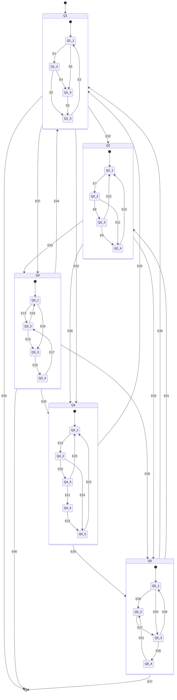
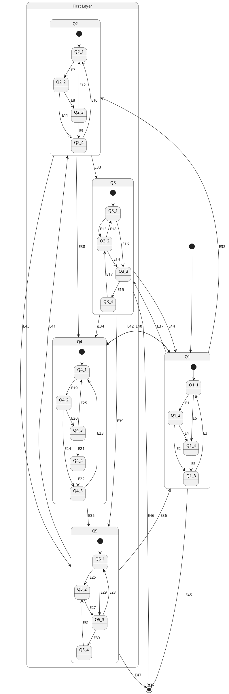

```mermaid
stateDiagram-v2
    [*] --> Q1
    
    state Q1 {
        [*] --> Q1_1
        Q1_1 --> Q1_2 : E1
        Q1_2 --> Q1_3 : E2
        Q1_3 --> Q1_1 : E3
        Q1_2 --> Q1_4 : E4
        Q1_4 --> Q1_3 : E5
        Q1_1 --> Q1_4 : E6
    }
    
    state Q2 {
        [*] --> Q2_1
        Q2_1 --> Q2_2 : E7
        Q2_2 --> Q2_3 : E8
        Q2_3 --> Q2_4 : E9
        Q2_4 --> Q2_1 : E10
        Q2_2 --> Q2_4 : E11
        Q2_3 --> Q2_1 : E12
    }
    
    state Q3 {
        [*] --> Q3_1
        Q3_1 --> Q3_2 : E13
        Q3_2 --> Q3_3 : E14
        Q3_3 --> Q3_4 : E15
        Q3_1 --> Q3_3 : E16
        Q3_4 --> Q3_2 : E17
        Q3_2 --> Q3_1 : E18
    }
    
    state Q4 {
        [*] --> Q4_1
        Q4_1 --> Q4_2 : E19
        Q4_2 --> Q4_3 : E20
        Q4_3 --> Q4_4 : E21
        Q4_4 --> Q4_5 : E22
        Q4_5 --> Q4_1 : E23
        Q4_2 --> Q4_5 : E24
        Q4_3 --> Q4_1 : E25
    }
    
    state Q5 {
        [*] --> Q5_1
        Q5_1 --> Q5_2 : E26
        Q5_2 --> Q5_3 : E27
        Q5_3 --> Q5_1 : E28
        Q5_1 --> Q5_3 : E29
        Q5_3 --> Q5_4 : E30
        Q5_4 --> Q5_2 : E31
    }
    
    Q1 --> Q2 : E32
    Q2 --> Q3 : E33
    Q3 --> Q4 : E34
    Q4 --> Q5 : E35
    Q5 --> Q1 : E36
    Q1 --> Q3 : E37
    Q2 --> Q4 : E38
    Q3 --> Q5 : E39
    Q4 --> Q1 : E40
    Q5 --> Q2 : E41
    Q1 --> Q4 : E42
    Q2 --> Q5 : E43
    Q3 --> Q1 : E44
    
    Q1 --> [*] : E45
    Q3 --> [*] : E46
    Q5 --> [*] : E47
```

```plantuml
@startuml
[*] --> Q1

state "First Layer" as Layer1 {
  state Q1 {
    [*] --> Q1_1
    Q1_1 --> Q1_2 : E1
    Q1_2 --> Q1_3 : E2
    Q1_3 --> Q1_1 : E3
    Q1_2 --> Q1_4 : E4
    Q1_4 --> Q1_3 : E5
    Q1_1 --> Q1_4 : E6
  }
  
  state Q2 {
    [*] --> Q2_1
    Q2_1 --> Q2_2 : E7
    Q2_2 --> Q2_3 : E8
    Q2_3 --> Q2_4 : E9
    Q2_4 --> Q2_1 : E10
    Q2_2 --> Q2_4 : E11
    Q2_3 --> Q2_1 : E12
  }
  
  state Q3 {
    [*] --> Q3_1
    Q3_1 --> Q3_2 : E13
    Q3_2 --> Q3_3 : E14
    Q3_3 --> Q3_4 : E15
    Q3_1 --> Q3_3 : E16
    Q3_4 --> Q3_2 : E17
    Q3_2 --> Q3_1 : E18
  }
  
  state Q4 {
    [*] --> Q4_1
    Q4_1 --> Q4_2 : E19
    Q4_2 --> Q4_3 : E20
    Q4_3 --> Q4_4 : E21
    Q4_4 --> Q4_5 : E22
    Q4_5 --> Q4_1 : E23
    Q4_2 --> Q4_5 : E24
    Q4_3 --> Q4_1 : E25
  }
  
  state Q5 {
    [*] --> Q5_1
    Q5_1 --> Q5_2 : E26
    Q5_2 --> Q5_3 : E27
    Q5_3 --> Q5_1 : E28
    Q5_1 --> Q5_3 : E29
    Q5_3 --> Q5_4 : E30
    Q5_4 --> Q5_2 : E31
  }

  Q1 --> Q2 : E32
  Q2 --> Q3 : E33
  Q3 --> Q4 : E34
  Q4 --> Q5 : E35
  Q5 --> Q1 : E36
  Q1 --> Q3 : E37
  Q2 --> Q4 : E38
  Q3 --> Q5 : E39
  Q4 --> Q1 : E40
  Q5 --> Q2 : E41
  Q1 --> Q4 : E42
  Q2 --> Q5 : E43
  Q3 --> Q1 : E44
}

Q1 --> [*] : E45
Q3 --> [*] : E46
Q5 --> [*] : E47

@enduml
```

